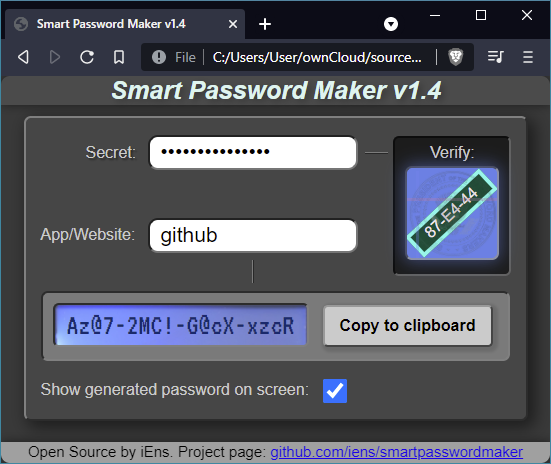

# Smart Password Maker

Smart Password Maker is a ***new innovative*** approach to creating passwords for websites and apps.
Smart Password Maker can create unique password for each user on each website, and recreate the passwords again when you need to log in again.

### Main features
- Creates passwords that are **unique to you**.
- Creates passwords that are **unique to every website** or app that you use passwords in.
- Creates password that contain at least two lowercase characters, two uppercase characters, two numbers and two special characters.
- Creates passwords without characters that are hard to distinguish.
- The passwords can always be regenerated in the future and **they don't change** if your secret passphrase and the website name are the same as when you first generated the passwords.
- Works on just about every platform and in every browser.
- Works on mobile devices
- On mobile devices you can save a shortcut to the home screen, turning the website into a WebApp.
- Open Source. You can verify the source code, and you can run it from your own server.

### Requirements
- A fairly modern web browser with JavaScript enabled.

### Local installation
Copy files from the html folder to a folder of your choice and open index.htm in your favorite browser.

### Webserver installation
Copy files from the html folder to your webserver. Subdirectories are not needed for normal operation. Make sure that index.htm is the default file.

### How to use
1. Select a good secret passphrase that you will use to generate all your other passwords.
2. Type your secret passphrase into the passphrase field.
3. Type the name of the website that you want to generate a password for (for example you can type Google or Apple or Facebook).
4. Your unique password can now be copied to the clipboard or be shown on the screen.
5. Create unique passwords for every website that you have an account on.
6. When you want to log in to a website, simply type your secret passphrase into the passphrase field, the name of the website into the website field, and now you get the SAME password.

### Why is it safe?
- The algorithm generating the passwords is based on SHA256
- It is impossible to calculate the secret from the generated password (But it can be brute forced. See below).
- The password is generated in your browser.
- No information is transmitted to the internet.
- Nothing is cached.
- Nothing is stored in a database
- Nothing is stored in the cloud
- If your secret passphrase is unique, then your passwords are unique to you and to the websites that you use them on.
- All your passwords can be generated again, as long as your secret passphrase and the website name are the same as when you first generated your passwords.
- You don't type your username into the Smart Password Generator. If a hacker somehow intercepts the passwords as they are generated, there is no direct correlation to your username. A password without a username is worthless.

### Why is it not safe?
- If your secret isn't a strong password, it is possible to brute force the secret. Please use a long string of numbers, letters and special characters so prevent this.

### What is the "Verify" image in the upper right corner?
1. It is important that you type your secret passphrase exactly the same every time you use Smart Password Maker.
2. It is also important that nobody can look over your shoulder and see what your secret passphrase is.
3. When you type in a secret, the "Verify Image" changes to unique colors and patterns. Remember how it looks.
4. Now you can verify that you have typed your secret correctly, just by looking at the Verify image. If it looks different than usual, you must have typed a different secret.

### Does this solve every problem with passwords?
No! Some websites don't allow certain characters. You will have to leave out those characters from your generated password. When you try to log in and your generated password doesn't match the password on the website, you will get an error message. You will probably not remember what you changed in the password. That's a problem.

If a website suddenly requires you to change your password, you can't use the generated password anymore. One solution could be to add a "2" to the website name in the generator. (eg. type "google2" instead of "google"). In the future, if the website says the password is wrong, you try adding the "2" to the website name.

Some websites use the same login as another. For example you normally use your Google-password to log in to YouTube. That means you have to remember that Google is the word you type into the App/Website field, even if it is YouTube you want to log in to. That can be a problem for some people.

Some websites may require longer passwords. That's a problem.

Some websites may require shorter passwords. That's a problem.

It seems like it is impossible to generate passwords that are compatible with every website on the internet.

If you have an idea how to solve those problem, please let us know.

### Why did you make this password generator when it doesn't solve every problem?
- Because it is better than some of the other solutions available.
- Because the approach is new and unique, as far as I know.
- Someone might look at this and get inspired to make an even better solution.
- If this idea gains ground, maybe websites will make sure they accept passwords generated by Smart Password Maker.

